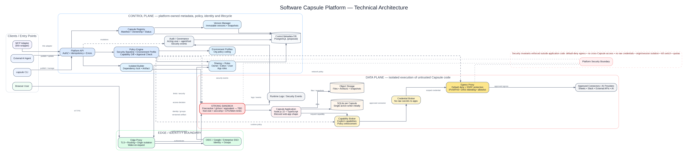
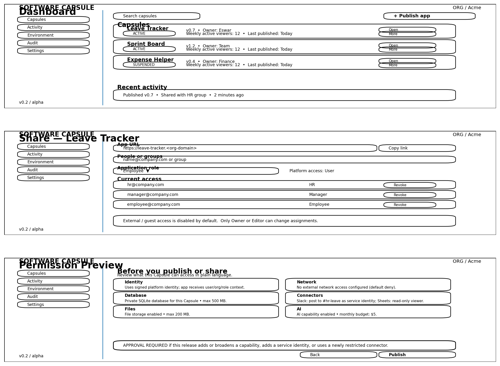

# Agent Capsule Platform

<p align="center">
  <strong>An agent-built internal tool becomes safely shareable with a colleague in one click.</strong>
</p>

<p align="center">
  <a href="https://github.com/lakshmikanth823/agent-capsule-platform/actions/workflows/ci.yml">
    
  </a>
  
  
  
  
</p>

---

## ⚡ The Simple Magic

1. **An AI Agent builds an internal tool** — via Claude, Cursor, Antigravity, or custom agents (`capsule init --template leave-tracker && capsule publish`).
2. **You click "Share"** — share with a teammate via email or role (`capsule share --app leave-tracker --email teammate@company.com --role employee`).
3. **Your teammate opens the link and it just works** — instant corporate identity, dedicated isolated database, and zero security risk.

> 📺 **2-Minute Walkthrough**: See [docs/DEMO_SCRIPT.md](docs/DEMO_SCRIPT.md) for the exact step-by-step demo flow.

### Why this doesn't exist today

When an AI agent writes code for an internal tool (a PTO tracker, an on-call dashboard, a customer look-up utility), **you cannot safely give it to a colleague without days of engineering overhead**:

- If you deploy it to your AWS/cloud, untrusted AI-generated code can exfiltrate IAM credentials, access your production database, or probe internal networks (SSRF).
- If you host it on traditional PaaS, you have to configure auth, database provisioning, subdomain certificates, and IAM roles yourself.

**Agent Capsule Platform is the runtime layer that makes agent-built software as safe and easy to share as a Google Doc.**

<p align="center">
  
</p>

```
                     ┌───────────────────────────────────────────────────────────┐
                     │                     Browser / Client                      │
                     └─────────────────────────────┬─────────────────────────────┘
                                                   │ HTTPS
                                                   ▼
                     ┌───────────────────────────────────────────────────────────┐
                     │               Edge Proxy (nginx / Node.js)                │
                     │  • Subdomain Origin Isolation (<app-id>.apps.domain.com)  │
                     │  • Enterprise SSO / SAML / OIDC Handshake & Cookies       │
                     │  • Cryptographic Identity Injection (x-capsule-identity)  │
                     └─────────────┬───────────────────────────────┬─────────────┘
                                   │                               │
                 ┌─────────────────▼──────────────┐  ┌─────────────▼─────────────┐
                 │    Control Plane API (8000)    │  │   Isolated Sandbox Host   │
                 │  • App & Version Registry      │  │  • gVisor (runsc) Sentry  │
                 │  • Environment Profiles Policy │  │  • Read-only rootfs       │
                 │  • SCIM 2.0 & SSO Providers    │  │  • --network none         │
                 │  • Tamper-Evident Audit Chain  │  │  • Dedicated SQLite DB    │
                 │  • AI Gateway & Monthly Budget │  │  • Local Blob Storage     │
                 └─────────────────┬──────────────┘  └─────────────┬─────────────┘
                                   │                               │ Outbound HTTP
                                   │                               ▼
                                   │                 ┌───────────────────────────┐
                                   │                 │    Egress Proxy (19080)   │
                                   └─────────────────►  • Manifest Domain Check  │
                                     Internal API    │  • SSRF / 169.254.169.254 │
                                                     │  • Byte Quota Tracking    │
                                                     └─────────────┬─────────────┘
                                                                   │
                                                                   ▼
                                                     ┌───────────────────────────┐
                                                     │   Allowed External APIs   │
                                                     │   LLMs / Google Sheets    │
                                                     └───────────────────────────┘
```

---

## ✨ Key Capabilities

### 🛡️ 1. Multi-Tenant Kernel Isolation (gVisor)

- **Zero Host Syscalls:** Sandboxes run under Google's **gVisor (`runsc`)** user-space kernel (Sentry), preventing container breakout and kernel privilege escalation.
- **Defense in Depth:** `--read-only` root filesystem, `--cap-drop=ALL`, `--no-new-privileges`, and `--pids-limit 64` (fork-bomb defense).
- **Default-Deny Networking:** Sandboxes start with `--network none`. Inbound requests enter via a controlled proxy bridge; outbound traffic must pass through the Egress Proxy.

### 🌐 2. Egress Proxy & SSRF Protection

- **Allowlist Enforced:** Outbound HTTP/HTTPS requests are strictly filtered against domains declared in the capsule's `capsule.manifest.yaml`.
- **Pre-Connection SSRF Defense:** DNS resolution pins IP addresses before connection. Prohibits cloud metadata endpoints (`169.254.169.254`), private RFC 1918 subnets, loopback, and DNS rebinding attacks.

### 🤖 3. Centralized AI Gateway

- **Zero Credential Exposure:** Capsules invoke LLMs (OpenAI, Gemini, Anthropic) via the `@capsule/sdk`. Provider API keys reside exclusively in the platform and are never exposed to apps.
- **Budget Hard Stops:** Per-app monthly cost caps enforced in real-time with fail-closed `429 BUDGET_EXCEEDED` errors.
- **Model Allowlists:** Controls which models an organization allows per Environment Profile.
- **Privacy Logging:** Content logging is strictly opt-in; only token counts and metadata are stored by default.

### 🔌 4. Model Context Protocol (MCP) Adapter

- Built with the official **MCP TypeScript SDK** (`@capsule/mcp-server`).
- Exposes 9 platform tools (`validate_manifest`, `publish`, `share`, `unshare`, `status`, `logs`, `versions`, `rollback`, `get_agent_guide`) over `stdio` and `HTTP/SSE`.
- Direct integration guides for **Claude Desktop**, **Cursor**, and **Antigravity**.

### 🏢 5. Enterprise SSO, SCIM & Governance

- **SAML 2.0 & OIDC:** Domain TXT verification, XML-DSig signature verification, and IdP certificate management.
- **SCIM 2.0 Directory Sync:** Full `/Users` and `/Groups` sync with rotatable bearer tokens and automatic deprovisioning cascades.
- **Lifecycle & Governance:** Inactivity-based archival (90-day default), owner-left departure grace periods, and streaming CSV/JSON inventory exports.
- **Tamper-Evident Audit Log:** Cryptographic SHA-256 hash chains verified on-demand via `capsule audit verify`.

### 🚨 6. Emergency Kill Switch & Quotas

- Immediate platform-wide or app-specific suspension via `POST /v1/admin/kill-switch`.
- Aborts in-flight requests in **under 1.2 seconds** (guaranteed within 5 seconds).
- Mass token and session revocation across entire organizations.

---

## 📁 Repository Structure

<p align="center">
  
</p>

```
.
├── apps/
│   └── dashboard/              # React 18 + Vite + Tailwind admin & developer console
├── deploy/                     # Production infrastructure & orchestration
│   ├── docker-compose.prod.yml # Production multi-service stack
│   ├── monitoring/             # Prometheus, Grafana, Alertmanager configs
│   ├── scripts/                # EC2 bootstrap, systemd units, backup restore drill
│   └── systemd/                # systemd service definitions
├── docs/                       # Complete architectural, technical & operational docs
│   ├── FINAL_READINESS_REPORT.md# Comprehensive 12-prompt readiness report
│   ├── TRACEABILITY.md         # Requirements traceability matrix (FR-001–FR-037)
│   ├── RUNBOOK.md              # Production operational runbook & disaster recovery
│   ├── PILOT_CHECKLIST.md      # Customer pilot onboarding & data handling guide
│   ├── THREAT_MODEL.md         # STRIDE threat model & residual risk assessment
│   ├── AI_GATEWAY.md           # AI Gateway architecture and budgeting
│   └── MCP.md                  # MCP Server setup for Claude, Cursor, Antigravity
├── examples/
│   └── leave-tracker/          # Reference blessed capsule app (TypeScript + SQLite)
├── packages/
│   ├── cli/                    # `capsule` CLI developer tool (publish, share, dev)
│   ├── manifest-schema/        # JSON Schema Draft 2020-12 validator for manifests
│   ├── mcp-server/             # Official Model Context Protocol (MCP) server
│   ├── sandbox-driver/         # gVisor (runsc) & Docker container lifecycle drivers
│   └── sdk/                    # `@capsule/sdk` runtime library (DB, Files, AI, Identity)
├── services/
│   ├── builder/                # Ephemeral containerized bundle compiler
│   ├── control-plane/          # FastAPI authoritative control plane & PostgreSQL DAL
│   ├── edge-proxy/             # Subdomain reverse proxy, auth handshake & rate limiter
│   └── egress-proxy/           # HTTP/CONNECT forward proxy with SSRF protection
└── tests/
    └── redteam/                # Adversarial security test suite (27 attack vectors)
```

---

## 🚀 Quickstart & Local Development

### Prerequisites

- **Node.js**: `v22.0.0` or higher
- **Python**: `3.12+` with virtual environment (`.venv`)
- **Docker Desktop**: Running with WSL2 backend or native Linux Docker daemon
- **Git**: `2.40+`

### 1. Clone & Install Dependencies

```bash
git clone https://github.com/lakshmikanth823/agent-capsule-platform.git
cd agent-capsule-platform

# Install monorepo Node dependencies
npm install

# Set up Python virtual environment for control plane
python -m venv .venv
.venv/Scripts/activate  # On Linux/macOS: source .venv/bin/activate
pip install -r services/control-plane/requirements.txt
```

### 2. Configure Environment

```bash
cp .env.example .env
```

### 3. Start Local Infrastructure

Start PostgreSQL (port 5432) and MinIO S3 (port 9000):

```bash
docker compose up -d
```

### 4. Build Monorepo Workspaces

```bash
npm run build
```

### 5. Run Verification Suites

```bash
# Run all TypeScript workspace tests (224 tests)
npm run test:ts

# Run all Python control plane tests (100 tests)
npm run test:py

# Run adversarial Red-Team security suite (27 tests)
npm run test:redteam
```

> [!NOTE]
> **Environment Adaptability:** In environments without a live Docker daemon or PostgreSQL (e.g. lightweight CI runners or sandboxed evaluators), container and DB-dependent tests automatically and cleanly skip with descriptive notes, while all unit, schema, and security invariants pass with exit code 0.

---

## 🛠️ CLI & Developer Workflow

Install the CLI globally or run it via npx:

```bash
npm install -g @capsule/cli
```

### 1. Initialize a New Capsule

```bash
capsule init --template leave-tracker
cd leave-tracker
```

### 2. Local Emulation with Hot Reload

```bash
capsule dev
# Launches local emulator at http://localhost:3000 with mock identity
```

### 3. Validate Manifest

```bash
capsule validate
# Validates shape, capabilities, egress, and limits offline against JSON Schema
```

### 4. Publish Version

```bash
capsule login
capsule publish --message "Release v1.0.0"
```

### 5. Share with Colleagues

```bash
# Share with an individual
capsule share --app leave-tracker --email teammate@company.com --role employee

# Share with an engineering group
capsule share --app leave-tracker --group engineering --role manager
```

---

## 🤖 MCP Server Setup

Connect the platform directly to your AI coding agents:

```json
{
  "mcpServers": {
    "capsule": {
      "command": "node",
      "args": ["packages/mcp-server/dist/index.js"],
      "env": {
        "CONTROL_PLANE_URL": "http://localhost:8000",
        "CAPSULE_API_TOKEN": "capsule-token-your-scoped-token"
      }
    }
  }
}
```

Available MCP Tools:

- `validate_manifest` — Offline manifest validation
- `publish` — Publish new capsule version with idempotency
- `share` / `unshare` — Manage RBAC access
- `status` / `logs` — Monitor container health and runtime logs
- `versions` / `rollback` — Safe version rollbacks with pre-rollback recovery snapshots
- `get_agent_guide` — Returns [`docs/AGENT_GUIDE.md`](docs/AGENT_GUIDE.md)

---

## 🔒 Security Posture & Verified Defenses

| Threat Surface               | Defense Mechanism                                                   | Proving Test Suite                  |
| ---------------------------- | ------------------------------------------------------------------- | ----------------------------------- |
| **Container Breakout**       | gVisor (`runsc`) user-space Sentry kernel + dropped caps            | `driver_conformance.test.ts`        |
| **SSRF & Metadata Theft**    | Connection-time DNS pinning; blocks `169.254.169.254` & RFC 1918    | `redteam.test.ts (SSRF)`            |
| **Cross-Capsule Data Theft** | Strict per-app SQLite database and blob directory namespaces        | `redteam.test.ts (Cross-Capsule)`   |
| **Identity Header Forgery**  | HMAC-SHA256 signature verification with `kid` key rotation          | `redteam.test.ts (Identity)`        |
| **Denial of Service**        | Cgroups v2 memory limits, `--pids-limit 64`, edge rate limiting     | `redteam.test.ts (Resource Limits)` |
| **LLM Budget Overrun**       | Per-app monthly hard stop; fail-closed `429`                        | `test_ai_gateway.py`                |
| **Audit Log Tampering**      | Cryptographic SHA-256 hash chain; PostgreSQL trigger blocks updates | `test_audit_system.py`              |

---

## 📚 Documentation Index

- **[2-Minute Demo Script](docs/DEMO_SCRIPT.md)** — Step-by-step walkthrough: Agent builds tool → 1-click share → colleague uses it.
- **[Final Readiness Report](docs/FINAL_READINESS_REPORT.md)** — Comprehensive review across all 12 prompts.
- **[Requirements Traceability Matrix](docs/TRACEABILITY.md)** — Proof mapping for FR-001 through FR-037.
- **[Production Runbook](docs/RUNBOOK.md)** — Deployment, backup restore drills, kill switch, monitoring.
- **[Pilot Customer Checklist](docs/PILOT_CHECKLIST.md)** — Onboarding, limits, support SLAs, and data handling.
- **[STRIDE Threat Model](docs/THREAT_MODEL.md)** — Detailed threat analysis and residual risk assessment.
- **[Environment Profiles](docs/ENVIRONMENT_PROFILE.md)** — Governance policy engine and schema.
- **[AI Gateway Architecture](docs/AI_GATEWAY.md)** — Model allowlists, token metering, and privacy logging.

---

## 📄 License

This project is licensed under the MIT License - see the [LICENSE](LICENSE) file for details.
