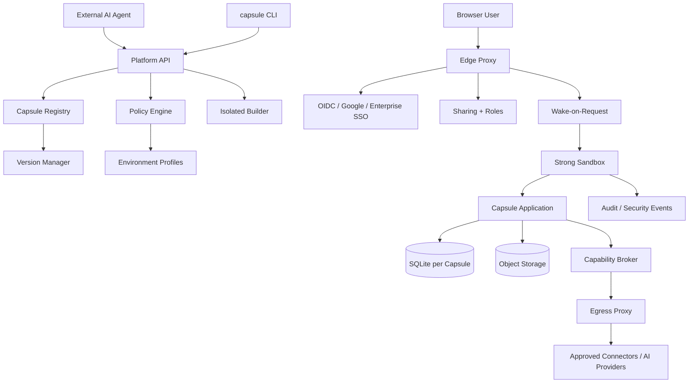

# Technical Requirements Document (TRD)
## Software Capsule Platform

**Version:** 0.1  
**Status:** Draft for technical review  
**Source:** Software Capsule Platform PRD v0.2  
**Date:** 2026-09-21

> This TRD translates the PRD into technical components, interfaces, data models, security controls, deployment behavior, testing requirements, and operational requirements. Where the PRD leaves a decision open, this document marks it **TBD** rather than silently treating an implementation choice as final.

---

# 1. Technical Objective

The platform securely deploys small applications generated or modified by external AI agents. All generated application code is treated as untrusted.

Core technical loop:

```text
Agent -> API/CLI -> Validate -> Policy -> Build -> Strong Sandbox
      -> Application URL -> Authentication -> Share -> Use
      -> Version -> Snapshot -> Rollback/Export
```

The platform, not the application SDK, is the security boundary.

# 2. Technical Principles

1. **Strong isolation by default.** Every Capsule gets the same class of strong isolation primitive. Resource size may vary; isolation strength does not.
2. **Control plane/data plane separation.** Platform metadata and policy remain outside application execution.
3. **Platform-owned identity.** Capsules declare application roles; the platform owns authentication and identity.
4. **Capability security.** Applications explicitly declare permissions; enforcement happens outside application code.
5. **Default deny.** Unrequested network access, credentials, undeclared capabilities, cross-Capsule access, and policy widening are denied.
6. **Small stable target.** Alpha supports one blessed application shape: Node.js 22 + TypeScript web application using the platform SDK.

# 3. System Architecture



## 3.1 Control Plane

Responsible for API, CLI/MCP interfaces, authentication integration, Capsule registry, manifests, versions, sharing, roles, Environment Profiles, policy evaluation, governance, audit, and deployment orchestration.

## 3.2 Data Plane

Responsible for application execution, sandboxing, SQLite, blob access, capability enforcement, credential brokering, quotas, and egress enforcement.

The application MUST NOT access control-plane databases or platform secrets directly.

# 4. Platform API

The API is the authoritative interface. CLI and MCP MUST use the same authorization, policy, and deployment logic.

**Proposed endpoints:**

```text
POST   /v1/capsules
GET    /v1/capsules/{id}
PATCH  /v1/capsules/{id}
POST   /v1/capsules/{id}/validate
POST   /v1/capsules/{id}/deploy
GET    /v1/capsules/{id}/versions
POST   /v1/capsules/{id}/share
DELETE /v1/capsules/{id}/share/{grant_id}
POST   /v1/capsules/{id}/capability-approvals
POST   /v1/capsules/{id}/rollback
POST   /v1/capsules/{id}/suspend
POST   /v1/capsules/{id}/resume
GET    /v1/capsules/{id}/logs
GET    /v1/capsules/{id}/events
POST   /v1/capsules/{id}/export
```

Endpoint names are implementation proposals, not fixed PRD requirements.

## 4.1 API Requirements

The API MUST:
- authenticate and authorize every mutation;
- validate request schemas;
- support idempotency for mutations;
- return stable machine-readable errors;
- record security-relevant actions;
- never expose platform secrets.

# 5. CLI and Agent Interface

Required CLI commands:

```bash
capsule init
capsule dev
capsule validate
capsule publish
capsule publish --dry-run
capsule status
capsule logs
capsule versions
capsule rollback
capsule share
capsule export
capsule suspend
capsule resume
```

JSON output MUST be available for agent workflows:

```bash
capsule validate --json
capsule publish --json
```

MCP is a thin adapter over the API, not a second authorization system.

# 6. Manifest Contract

Every Capsule has a machine-readable manifest validated against a published JSON Schema.

```yaml
name: leave-tracker
shape: web-app
runtime: node22
roles: [employee, manager, hr]
capabilities:
  db: sqlite
  files: { max_mb: 200 }
  identity: true
  ai: { monthly_budget_usd: 5 }
  connectors:
    - name: sheets.read
      acts_as: viewer
    - name: slack.post
      channel: "#hr-leave"
      acts_as: service
egress: []
sharing: { default: org }
limits:
  cpu: small
  memory_mb: 256
  request_timeout_s: 30
```

Validation order:

```text
Syntax -> JSON Schema -> Shape -> Runtime -> Capabilities
-> Resource Limits -> Environment Profile -> Security Policy
-> Capability Diff -> Approval Check
```

Validation failure MUST prevent deployment and return a structured error.

# 7. Blessed Application Shape

Alpha supports one application shape:

> Node.js 22 + TypeScript web application using the platform SDK.

The reference SDK SHOULD expose controlled interfaces for:

```text
HTTP server
SQLite
Files
Identity
Capabilities
AI
Logging
```

Applications MUST NOT directly access platform infrastructure.

# 8. Build System

Builds occur in an isolated builder separate from production Capsules.

The builder MUST:
- have no production credentials;
- enforce CPU, memory, time and storage limits;
- support dependency lockfiles;
- record dependency metadata;
- produce a versioned artifact;
- prevent access to unrelated Capsule data.

Dependency/code scanning MAY run asynchronously as warnings. Scanning is not the runtime security boundary.

# 9. Sandbox Runtime

Every Capsule MUST execute in a strong sandbox suitable for untrusted generated code.

Required properties:
- process isolation;
- filesystem isolation;
- network isolation;
- non-root execution;
- CPU/memory/request limits;
- syscall restrictions;
- controlled mounts and environment variables;
- no host credential access.

**Sandbox decision: TBD.** Evaluate Firecracker, gVisor, or equivalent.

### Sandbox Spike

Measure:
- isolation/adversarial escape resistance;
- p50/p95 cold start;
- memory overhead;
- network-policy hooks;
- filesystem controls;
- operational complexity;
- idle and active cost.

# 10. Capsule Lifecycle

```text
DRAFT -> VALIDATING -> PUBLISHED -> RUNNING -> SUSPENDED -> ARCHIVED
```

Deployment states:

```text
PENDING -> VALIDATING -> APPROVAL_REQUIRED -> BUILDING
        -> DEPLOYING -> ACTIVE
        -> FAILED / ROLLED_BACK
```

Invalid transitions MUST be rejected. State transitions MUST be persisted.

# 11. Deployment Pipeline

```text
Publish request
  -> Manifest/application validation
  -> Environment policy check
  -> Capability change detection
  -> Approval if required
  -> Isolated build
  -> Deployment snapshot
  -> Sandbox deployment
  -> Health check
  -> Activate version
```

If deployment fails, the previous active version MUST remain active where technically possible.

# 12. Versioning and Snapshots

Every successful deployment creates an immutable version containing references to:

- artifact;
- manifest;
- database snapshot;
- publisher user/agent;
- timestamp;
- change description;
- capability set/hash.

A database snapshot MUST be created on every deployment.

Proposed object layout:

```text
capsules/{capsule_id}/
  artifacts/{version_id}.tar.gz
  snapshots/{snapshot_id}.sqlite
  exports/{export_id}.tar.gz
```

# 13. Safe Rollback

Two modes exist.

## 13.1 Code-only rollback

If the target version is schema-compatible, restore application code while preserving current data. This is the default.

## 13.2 Code + data restore

Requires explicit confirmation and MUST show:
- target version;
- snapshot timestamp;
- affected data/time window;
- estimated record/data loss;
- recovery snapshot availability.

A fresh recovery snapshot MUST be created immediately before a data-changing rollback. The rollback itself must therefore be undoable.

# 14. SQLite and Object Storage

Each Capsule MUST have its own SQLite database, size quota, storage location, snapshot capability and export path.

The initial runtime SHOULD use one active Capsule instance for writes. SQLite concurrency limits form part of the scale envelope.

Object storage holds artifacts, snapshots, uploads and exports. Raw object-storage credentials MUST NOT be exposed to applications.

PostgreSQL is not the default Capsule database. A later PostgreSQL capability may serve applications that outgrow SQLite.

# 15. Identity Architecture

```text
User -> Capsule URL -> Edge -> Identity Provider
     -> Share Authorization -> Capsule-specific session
     -> Signed identity context -> Sandbox
```

The identity context SHOULD contain:

```json
{
  "iss": "platform",
  "aud": "capsule:<capsule_id>",
  "sub": "user-id",
  "org_id": "org-id",
  "groups": ["engineering"],
  "roles": ["employee"],
  "iat": 0,
  "exp": 0
}
```

The application MUST verify signature, issuer, audience and expiry. Signing keys MUST support rotation.

# 16. Session and Origin Isolation

Each Capsule MUST have an isolated application origin and MUST NOT share authentication cookies/session state with another Capsule or the platform dashboard.

Required controls include:
- host-only or `__Host-` cookies where applicable;
- Secure/HttpOnly/SameSite attributes as appropriate;
- strict CSP;
- framing restrictions;
- application-specific token audience.

The exact registrable-domain strategy is **TBD** and requires browser-security review. The PRD's security property is the requirement; the domain mechanism is an implementation decision.

# 17. Sharing and Roles

Two role systems are used:

### Platform roles

```text
Owner / Editor / User
```

These govern management of the Capsule.

### Application roles

Declared by the application, for example:

```text
Employee / Manager / HR
```

These govern behavior inside the application.

The platform MUST NOT interpret an application role as a platform administrative role.

External/guest users are out of scope for Alpha and default disabled.

Permission revocation SHOULD take effect within seconds under normal operation.

# 18. Capability System

Capabilities include:

```text
db.sqlite
files
identity
ai
sheets.read
slack.post
```

Effective capability access is evaluated as:

```text
Manifest
AND Organization Policy
AND User/Application Context
AND Connector Policy
```

The application manifest can narrow but never widen organization policy.

Enforcement MUST happen outside SDK cooperation at sandbox, storage, identity and network boundaries.

# 19. Capability Escalation

On every update the platform computes:

```text
Old capabilities -> New capabilities -> Diff
```

If a capability is new or broadened, deployment enters `APPROVAL_REQUIRED`.

Human approval is required for, at minimum:
- new capability;
- broader capability;
- new service identity;
- newly restricted connector.

An agent's publish credential MUST NOT approve its own escalation.

Normal updates that do not change privileged capabilities may deploy without manual approval, subject to policy.

# 20. Egress Architecture

```text
Capsule -> Capability Broker -> Egress Policy -> Trusted DNS/Destination Check
         -> Egress Proxy -> Approved External Service
```

Default:

```text
egress = DENY
```

The application cannot widen the Environment Profile.

The egress layer MUST block:
- loopback;
- private IPv4/IPv6 ranges;
- link-local addresses;
- cloud metadata endpoints;
- internal services;
- prohibited DNS destinations.

It MUST handle DNS rebinding, redirects, IPv4/IPv6 behavior and encoded IP representations.

# 21. Credential Broker

Applications never receive raw connector credentials.

```text
Application -> Capability Broker -> Policy -> Credential Broker
             -> Egress Proxy -> Connector
```

Credentials MUST NOT be placed in application environment variables, source artifacts, SQLite, manifests, logs or exports.

# 22. Connector Identity

Default connector behavior:

```text
acts_as: viewer
```

The connector uses the signed-in viewer's authorization where supported.

Service identity requires explicit configuration and authorization. It MUST be visible in permission preview, policy-controlled, and audited.

# 23. AI Capability

AI is an optional capability. The platform MUST control provider/model selection, authentication, budgets, request limits, logging and retention.

AI tool execution is denied unless separately authorized.

Exact providers/models are **TBD**.

# 24. Environment Profiles

An Environment Profile is an organization-level policy object controlling:

- allowed shapes/runtimes;
- capabilities;
- connectors;
- sharing;
- egress;
- AI budgets;
- resource limits;
- identity/security requirements.

Policy precedence:

```text
Platform Security Baseline
  -> Organization Environment Profile
  -> Capsule Manifest
  -> User/Application Context
  -> Runtime Enforcement
```

Lower layers MUST NOT weaken higher-level security requirements.

# 25. Quotas

The quota system MUST enforce limits for:

- Capsules per user/org;
- CPU;
- memory;
- database size;
- blob storage;
- request duration/rate;
- egress bytes;
- AI spend.

Lifecycle:

```text
NORMAL -> WARNING -> THROTTLED -> BLOCKED / GRADUATION REQUIRED
```

Quota enforcement occurs outside application code.

# 26. Kill Switch and Revocation

The Capsule owner, authorized administrator, or platform security system MUST be able to suspend a Capsule immediately.

Suspension MUST:
- stop new requests;
- prevent connector access;
- preserve data/version history;
- record the event.

Organization administrators MUST be able to disable connectors globally. Publish credentials MUST support mass revocation.

# 27. Publish Credential Security

Agent authentication SHOULD use OAuth/device-code or equivalent short-lived interactive credentials.

Credentials SHOULD be:
- short-lived;
- scoped;
- revocable;
- associated with user/org;
- associated with Capsule where possible.

Long-lived secrets pasted into prompts are not the normal workflow.

# 28. Audit

Security/governance events MUST capture:

```json
{
  "event_id": "event-id",
  "timestamp": "timestamp",
  "actor_user": "user-id",
  "actor_agent": "agent-id-or-tool",
  "organization": "org-id",
  "capsule": "capsule-id",
  "action": "publish",
  "target_version": "version-id",
  "result": "success"
}
```

Audit storage MUST be tamper-resistant. Retention duration is **TBD**. Company-ready release MUST support export.

# 29. Core Data Model

Platform metadata entities:

```text
Organization
User
Group
Capsule
CapsuleVersion
Manifest
Deployment
Snapshot
ShareGrant
PlatformRole
ApplicationRole
Capability
EnvironmentProfile
Connector
CredentialReference
AuditEvent
Quota
```

Proposed Capsule fields:

```text
id
organization_id
owner_id
name
slug
shape
runtime
state
current_version_id
environment_profile_id
created_at
updated_at
last_activity_at
```

Proposed CapsuleVersion fields:

```text
id
capsule_id
artifact_ref
manifest_ref
snapshot_ref
publisher_user_id
publisher_agent_id
created_at
status
change_description
capability_hash
```

# 30. Control-Plane Storage

**Proposed:** PostgreSQL for platform metadata.

It stores users, organizations, Capsules, versions, manifests, sharing, policies and audit metadata. It does NOT store application data as the default Capsule database.

Production requirements include backups, encryption, least privilege, migrations and connection controls.

# 31. Data Protection

The platform MUST provide:
- encryption in transit;
- encryption at rest;
- protected backups;
- defined deletion period after Capsule removal;
- full application/data export;
- recovery snapshots;
- defined RPO/RTO before production.

The PRD does not specify final RPO/RTO or deletion numbers; those remain **TBD**.

# 32. Export and Deletion

Export SHOULD include:

```text
manifest
application artifact
SQLite database
uploaded files
version metadata
safe configuration
```

Secrets and credentials MUST never be included.

Deletion sequence:

```text
Stop -> Revoke access -> Remove routing -> Mark data for deletion
-> Preserve required audit -> Delete after retention -> Record completion
```

# 33. Build and Content Security

Production builds MUST be isolated from production credentials and unrelated data.

The platform SHOULD provide secure defaults such as:
- HTTPS;
- HSTS;
- CSP;
- secure cookies;
- MIME-sniffing protection;
- framing restrictions.

Capsules MUST NOT weaken platform-required isolation headers.

# 34. Observability

MVP telemetry:

```text
Requests
Errors
Runtime Logs
Deployment Events
Sandbox Events
Quota Events
Security Events
Egress Decisions
```

Events SHOULD include timestamp, Capsule ID, version, request ID and result.

Advanced distributed tracing/enterprise metrics are deferred.

# 35. Failure Handling

### Build failure
No active-version change; return structured error.

### Policy failure
No deployment; return policy reason.

### Sandbox failure
Retry according to policy; retain previous active version where possible; record failure.

### Health-check failure
New version MUST NOT become active until required checks pass.

# 36. Health Checks

The platform SHOULD support:
- process readiness;
- HTTP health endpoint;
- startup timeout;
- request timeout.

Health checks MUST NOT grant unrestricted network access.

# 37. Wake-on-Request and Idle

Scale-to-zero behavior:

```text
Request -> Check state -> Start sandbox if idle -> Health check -> Forward request
```

Initial target: cold-start p95 < 2 seconds.

Idle compute should approach storage-dominant cost. Idle shutdown MUST preserve SQLite state, versions and routing metadata.

# 38. Performance

PRD targets:

| Metric | Target |
|---|---|
| Publish -> working URL | p95 < 30s for reference app |
| Share -> first render | < 60s with active IdP session |
| Cold start | p95 < 2s |
| Reference bundle | < 5 MB |
| Idle compute | near-zero / storage-dominant |

Benchmarks MUST define hardware, network conditions, app size, dependencies, sandbox and authentication state.

# 39. Scale Envelope

The platform MUST define numerical limits for:
- users/Capsule;
- concurrent requests;
- SQLite size;
- blob size;
- CPU/memory;
- request duration/rate;
- egress;
- AI spend.

The PRD intentionally leaves final values open. Alpha load testing MUST establish them before production guarantees are made.

# 40. Testing Strategy

Testing layers:

```text
Unit
Integration
API/Schema Contract
Security/Adversarial
Load
Failure/Chaos
Recovery
End-to-End
```

## 40.1 Unit

Test manifest validation, policy evaluation, capability diff, role mapping, share authorization, quotas, state transitions, rollback selection and error mapping.

## 40.2 Integration

Test API/registry, API/builder, policy engine, edge/identity, edge/Capsule, Capsule/SQLite, broker/egress, egress/connectors and snapshot/restore.

## 40.3 Security

Malicious Capsules MUST attempt:
- host filesystem access;
- another Capsule's database/filesystem;
- metadata services;
- private IP access;
- DNS rebinding;
- IPv4/IPv6 bypass;
- cookie/session theft;
- credential extraction;
- capability bypass/escalation;
- resource exhaustion;
- control-plane access.

## 40.4 Load

Test many idle Capsules, simultaneous wake-ups, concurrent publishes, concurrent users, snapshots, egress traffic, logs and policy evaluation.

## 40.5 Recovery

Test restoration of control-plane metadata, SQLite, artifacts, routing, versions, permissions and policy. Restore procedures MUST be executed, not only documented.

# 41. Environments

Minimum:

```text
Development
Staging
Production
```

Staging MUST not use production connector credentials or production data.

# 42. Proposed Initial Technology Stack

| Area | Proposed implementation |
|---|---|
| Application runtime | Node.js 22 |
| Application language | TypeScript |
| Control API | FastAPI/Python |
| CLI | TypeScript or Python |
| MCP | Thin API adapter |
| Control metadata | PostgreSQL |
| Capsule data | SQLite |
| Artifacts/files | S3-compatible object storage |
| Sandbox | Firecracker/gVisor/equivalent |
| Identity | OIDC provider |
| Edge | Platform edge proxy |
| Egress | Dedicated egress proxy |
| Credentials | Secure secret store + credential broker |
| Logs | Central log system |
| Orchestration | Minimal initial orchestration |
| Kubernetes | Deferred |

These are proposed implementation choices. They can change if the technical contracts and security properties remain intact.

# 43. Build vs Buy

## Build

The product-specific moat should include:
- Capsule manifest/API/CLI;
- policy engine;
- capability system;
- sharing/roles;
- edge identity/routing;
- credential broker integration;
- egress policy;
- version/rollback workflow;
- Environment Profiles;
- governance.

## Buy/Reuse

Prefer existing solutions for:
- sandbox runtime;
- identity provider;
- object storage;
- TLS/certificates;
- secure secret storage;
- basic logging infrastructure.

# 44. Deferred Technical Systems

Do not introduce in Alpha/MVP unless measured requirements justify them:

- Kubernetes as product abstraction;
- Redis;
- runtime tiers;
- Postgres per Capsule;
- marketplace;
- full enterprise observability platform;
- arbitrary containers;
- built-in AI coding agent;
- mandatory approval on every deployment;
- scheduled execution before its Phase 3 scope.

# 45. API Error Model

Errors SHOULD use stable codes:

```text
invalid_manifest
unsupported_shape
unsupported_runtime
capability_not_allowed
approval_required
approval_denied
quota_exceeded
egress_denied
authentication_required
authorization_denied
capsule_suspended
version_not_found
rollback_incompatible
snapshot_failed
build_failed
deployment_failed
connector_disabled
token_revoked
```

Example:

```json
{
  "error": {
    "code": "capability_not_allowed",
    "message": "The requested capability is not allowed.",
    "details": {
      "capability": "slack.post",
      "reason": "Organization policy prohibits Slack connectors"
    }
  }
}
```

# 46. Idempotency and Concurrency

Mutation endpoints MUST accept an idempotency key. Repeated requests with the same key MUST NOT create duplicate deployments.

The control plane MUST prevent conflicting Capsule operations such as simultaneous deploy and rollback. A Capsule SHOULD have one active deployment operation at a time.

# 47. Access-Control Matrix

| Action | Owner | Editor | User | Agent |
|---|---:|---:|---:|---:|
| View app | Yes | Yes | Yes | N/A |
| Normal publish | Yes | Policy | No | Policy |
| Change sharing | Yes | Policy | No | No |
| Approve capability escalation | Yes | Policy | No | **No** |
| Rollback | Yes | Policy | No | Policy |
| Suspend | Yes | Policy | No | No |
| Export | Yes | Policy | No | No |
| Change ownership | Yes | No | No | No |

Organization policy can further restrict these permissions.

# 48. Security Boundaries

The following are explicit boundaries:

1. sandbox;
2. Capsule filesystem;
3. Capsule database;
4. application origin;
5. identity context;
6. capability layer;
7. egress layer;
8. credential broker;
9. organization policy.

The SDK is NOT a security boundary.

# 49. Security Metrics and Gates

Required release security suite:

> 100% of required red-team tests pass before release.

Operational targets include:
- zero confirmed cross-Capsule data-access incidents;
- blocked unauthorized egress is logged;
- capability escalation is never approved by the requesting agent.

# 50. Technical Traceability

| PRD | Technical area | Verification |
|---|---|---|
| FR-001 | API/CLI/publish | E2E publish |
| FR-002 | Manifest/JSON Schema | Contract tests |
| FR-003 | Blessed shape | Validation tests |
| FR-004 | Sandbox | Adversarial tests |
| FR-005 | Origin | Browser security tests |
| FR-006/7 | Identity | OIDC/token tests |
| FR-008/9/10 | Roles/sharing | Authorization E2E |
| FR-012/13/14 | SQLite/snapshots/rollback | Recovery tests |
| FR-016/17/32 | Capabilities | Escalation/adversarial tests |
| FR-019/20/21 | Egress/SSRF | Network security suite |
| FR-023/24/25/26 | Credentials/connectors | Broker integration tests |
| FR-027/28 | Environment Profiles | Policy contract tests |
| FR-029/30/31 | Versions | Version/rollback tests |
| FR-037/38/39/40/41 | Audit/kill/revocation/quotas | Governance/security tests |
| FR-042/43/44/45 | Agent tooling | CLI/API contract tests |
| FR-046 | Scheduling | Deferred to Phase 3 |

# 51. Phase 0 Technical Deliverables

- Platform API
- CLI
- Capsule registry
- Manifest JSON Schema
- validation/dry-run
- local `capsule dev`
- isolated builder
- selected strong sandbox
- edge routing
- Google/OIDC authentication
- origin/session isolation
- sharing
- SQLite
- object storage
- basic logs

**Exit:** reference application can be built, validated, published and opened by an authorized colleague within the defined 60-second workflow.

# 52. Phase 1 Technical Deliverables

- capability engine;
- policy engine;
- default-deny egress;
- egress proxy;
- SSRF protection;
- credential broker;
- viewer/service identity;
- roles;
- versions;
- snapshots;
- safe rollback;
- kill switch;
- quotas;
- adversarial security suite.

**Exit:** malicious test Capsule cannot access another Capsule's data/session, bypass egress, obtain raw credentials, self-approve capability escalation, or escape the tested sandbox boundary.

# 53. Phase 2 Technical Deliverables

- Environment Profiles;
- enterprise SSO;
- SCIM;
- organization inventory;
- audit retention/export;
- connector administration;
- ownership/deprovisioning policy.

**Exit:** an administrator can restrict capabilities, connectors, sharing, egress and resource limits without modifying application source code.

# 54. Phase 3 Technical Deliverables

- scheduled execution;
- expiry;
- ownership transfer;
- previews;
- PostgreSQL capability;
- additional runtimes;
- templates/forking;
- private/VPC data plane.

Exact scale targets are to be set after production measurements.

# 55. Open Technical Decisions

1. Firecracker vs gVisor vs equivalent sandbox.
2. Exact Capsule domain/registrable-domain architecture.
3. SQLite size/concurrency envelope.
4. RPO/RTO.
5. Audit retention.
6. AI provider/model list.
7. First production connector.
8. Enterprise identity provider.
9. Numerical quota limits.
10. Export archive format.
11. Exact API versioning and endpoint names.
12. Orchestration implementation.

These are intentionally open because the PRD does not establish final values.

# 56. Technical Definition of Done

A release is technically ready when:

```text
PRD requirement
 -> Technical design
 -> Implementation
 -> Automated test
 -> Security test
 -> Operational/recovery test
 -> Release gate
```

Security-critical behavior cannot be considered complete solely because the application SDK checks it.

## Alpha checklist

- [ ] Agent authentication works without pasted long-lived secrets.
- [ ] `capsule dev` works.
- [ ] `capsule validate` works.
- [ ] Dry-run publish works.
- [ ] Reference Capsule publishes.
- [ ] Strong sandbox is selected and tested.
- [ ] Capsule origin/session isolation passes tests.
- [ ] Google/OIDC login works.
- [ ] Sharing works.
- [ ] SQLite isolation works.
- [ ] Resource limits work.
- [ ] Failed deployment preserves active version.
- [ ] Machine-readable errors work.
- [ ] Basic logs work.

## MVP checklist

- [ ] Capability enforcement works outside SDK cooperation.
- [ ] Capability escalation requires human approval.
- [ ] Default-deny egress works.
- [ ] SSRF suite passes.
- [ ] Credential broker works.
- [ ] Viewer identity works where supported.
- [ ] Service identity requires explicit authorization.
- [ ] Roles work.
- [ ] Every deployment creates a snapshot.
- [ ] Safe rollback works.
- [ ] Kill switch works.
- [ ] Connector/token revocation works.
- [ ] Quotas work.
- [ ] Encryption is enabled.
- [ ] Export works.
- [ ] Required red-team suite passes.

# 57. Final Technical Architecture

```text
                 EXTERNAL AI AGENTS
                         |
                   API / CLI / MCP
                         |
              +----------v-----------+
              |      CONTROL PLANE   |
              | API / Registry       |
              | Versions             |
              | Policy Engine        |
              | Sharing / Roles      |
              | Environment Profiles |
              | Governance / Audit   |
              | Build Service        |
              +----------+-----------+
                         |
                  Deployment Control
                         |
              +----------v-----------+
              |         EDGE         |
              | TLS / Routing        |
              | Identity / Share     |
              | Wake-on-Request      |
              +----------+-----------+
                         |
              +----------v-----------+
              |      DATA PLANE      |
              | Strong Sandbox       |
              | Node/TS Application  |
              | SQLite                |
              | Object Storage       |
              | Capability Broker    |
              | Quotas               |
              | Egress Proxy         |
              +------+---------+-----+
                     |         |
              Credentials    Network
                     |         |
              +------v---------v-----+
              | External Connectors |
              | Sheets / Slack / CRM |
              | AI Providers         |
              +---------------------+
```

The platform's technical role is to provide the secure execution, identity, permission, networking, data, sharing, lifecycle, and governance layer around software created by external agents.
